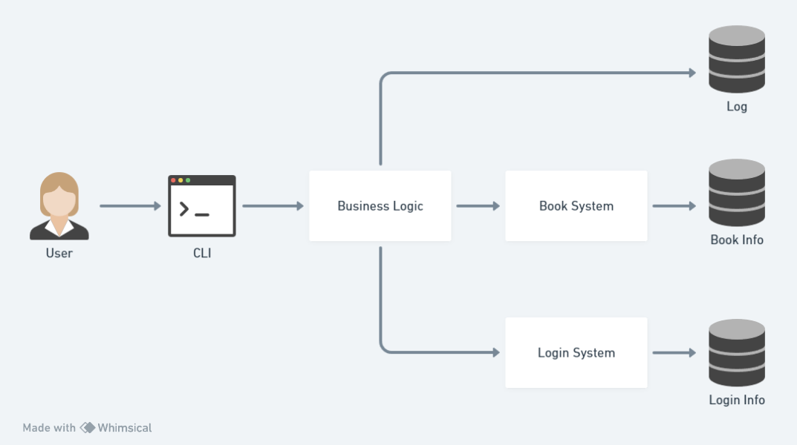

# General Design
## 功能设计
The system provides the following functions:
- User management
- Book management
- Book purchase
- Book import
- Log management

There are 5 components in the system: the database, the login system, the book system, the business logic and the command line interface.

The database stores the information of the users, the books and the logs.

The login system is responsible for user management. It provides the following functions:
- User login
- User logout
- User registration
- User password change
- User creation

The book system is responsible for book management. It provides the following functions:
- Book search
- Book purchase
- Book information modification
- Book import

The business logic is responsible for the business logic. It handles the user requests and interacts with the database. It also checks the permissions of the users.

The command line interface is responsible for user interaction. It handles the user input and output.

The following figure shows the overall design of the system.

## 用户交互设计
All the commands are listed below.

| Command | Description |
| --- | --- |
| `help` | Show help message |
| `su` | Switch user |
| `exit` | Logout or exit the system |
| `useradd` | Add a new user |
| `passwd` | Change password |
| `query` | Search for books |
| `buy` | Purchase books |
| `modify` | Modify book information |
| `import` | Import books |
| `log` | Show logs |

### `help`
Format: `help ([Command])?`

Output: the help message.

Show help message. If `Command` is specified, show the help message of the command.

### `su`
Format: `su [UserID] ([Password])?`

Output: none

Switch user. 
If `Password` is not specified, the user will be prompted to enter the password.
Specially, the root user can switch to any user without entering the password.

### `exit`
Format: `exit`

Output: none

Logout or exit the system. If the user is not logged in, exit the system.

### `useradd`
Format: `useradd [UserID] [Password] [Privilege] [Username]`

Output: none

Add a new user.

### `passwd`
Format: `passwd [UserID] ([CurrentPassword])? [NewPassword]`

Output: none

Change password. If `CurrentPassword` is not specified, the user will be prompted to enter the current password.
Specially, the root user can change the password of any user without entering the current password.

### `query`
Format: `query (-ISBN=[ISBN] | -name="[BookName]" | -author="[Author]" | -keyword="[Keyword]")?`

Output: The information of the books sorted by ISBN. Each line contains the information of a book. The format is `[ISBN]\t[Name]\t[Author]\t[Keyword]\t[Price]\t[Quantity]`.

Search for books. If no option is specified, show all books.

### `buy`
Format: `buy [ISBN] [Quantity]`

Output: none

Purchase books.

### `modify`
Format: `modify (-ISBN=[ISBN] | -name="[BookName]" | -author="[Author]" | -keyword="[Keyword]" | -price=[Price])`

Output: none

Modify book information.

### `import`
Format: `import [Quantity] [TotalCost]`

Output: none

Import books.

### `log`
Format: `log`

Output: The information of the logs sorted by time. Each line contains the information of a log. The format is `[Time]\t[UserID]\t[Operation]\t[ISBN]\t[Quantity]\t[Price]`.

Show logs.

## 数据库设计
There are 3 tables in the database: `users`, `books` and `logs`.
### `users`
| Field | Type | Description |
| --- | --- | --- |
| `UserID` | `VARCHAR(16)` | User ID |
| `Password` | `VARCHAR(16)` | Password |
| `Privilege` | `INT` | Privilege |
| `Username` | `VARCHAR(32)` | Username |

### `books`
| Field | Type          | Description      |
| --- |---------------|------------------|
| `ISBN` | `VARCHAR(20)` | ISBN             |
| `Name` | `VARCHAR(60)` | Name             |
| `Author` | `VARCHAR(60)` | Author           |
| `Keyword` | `VARCHAR(60)` | Keyword          |
| `Price` | `INT`         | Price (in cents) |
| `Quantity` | `INT`         | Quantity         |

### `logs`
| Field | Type | Description |
| --- | --- | --- |
| `Time` | `DATETIME` | Time |
| `UserID` | `VARCHAR(16)` | User ID |
| `Operation` | `VARCHAR(16)` | Operation |
| `ISBN` | `VARCHAR(20)` | ISBN |
| `Quantity` | `INT` | Quantity |
| `Price` | `DOUBLE` | Price |
