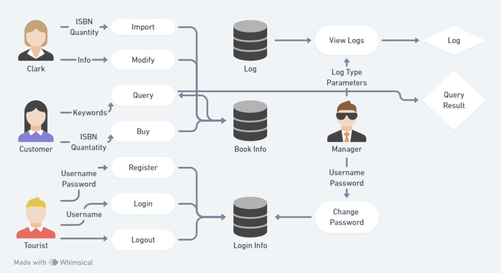

# Requirement Analysis
## 业务流程

P.S. A user with higher privilege can do all the things that a user with lower privilege can do.
e.g. A manager (with privilege 7) can import books, which a clerk (with privilege 3) can also do.
## 数据流程
